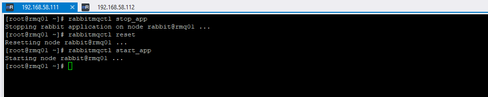
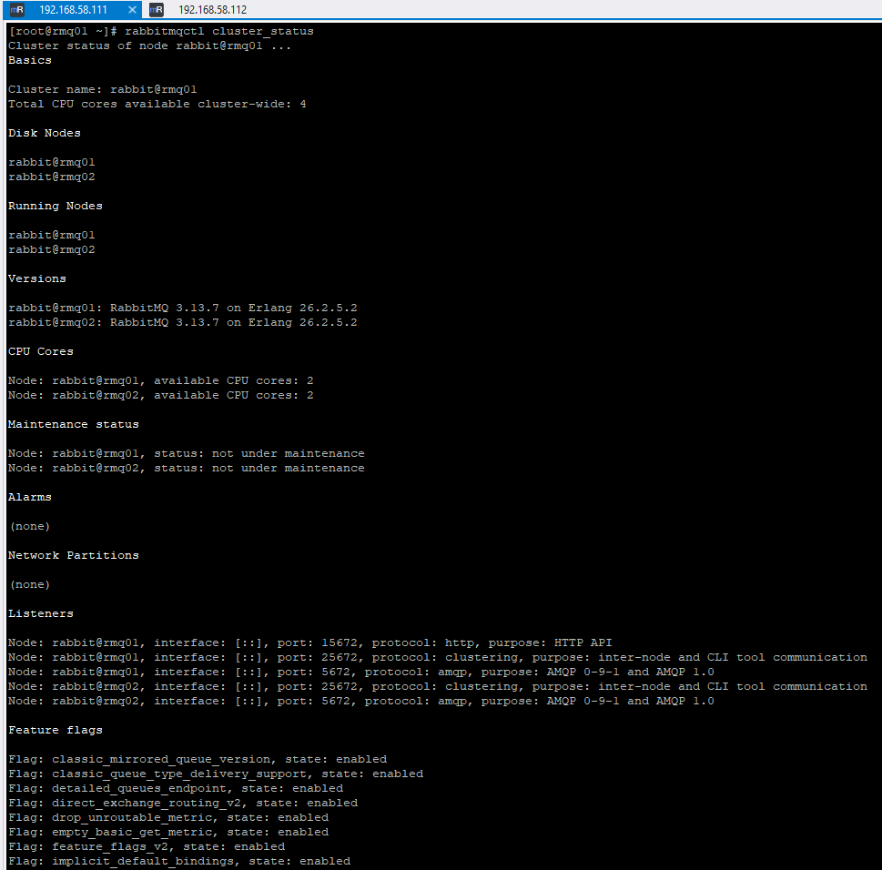
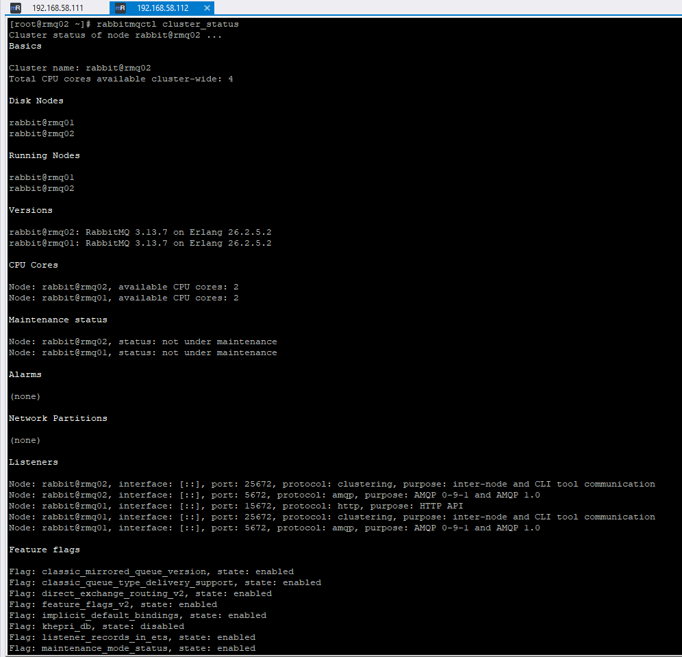
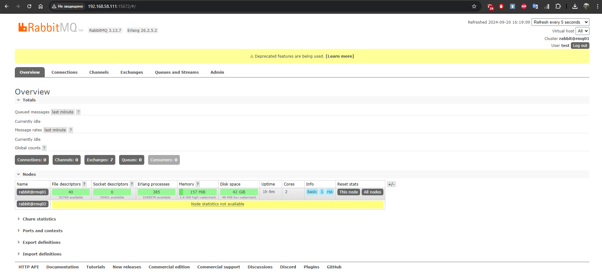

# Домашнее задание к занятию "`Очереди RabbitMQ`" - `Дедюрин Денис`

---
## Задание 1. Установка RabbitMQ

Используя Vagrant или VirtualBox, создайте виртуальную машину и установите RabbitMQ. Добавьте management plug-in и зайдите в веб-интерфейс.

Итогом выполнения домашнего задания будет приложенный скриншот веб-интерфейса RabbitMQ.

### Ответ:

**Устанавливаем RabbitMQ:**
```
yum update -y
yum install -y epel-release
yum install -y erlang
yum install -y rabbitmq-server
```
**Запускаем:**
```
systemctl enable rabbitmq-server
systemctl start rabbitmq-server
```
**Активируем плагин управления RabbitMQ:**
```
rabbitmq-plugins enable rabbitmq_management
```
**Перезапускаем RabbitMQ:**
```
systemctl restart rabbitmq-server
```

В браузере переходим в web-интерфес по адресу: http://192.168.58.111:15672


---
## Задание 2. Отправка и получение сообщений
Используя приложенные скрипты, проведите тестовую отправку и получение сообщения. Для отправки сообщений необходимо запустить скрипт producer.py.

Для работы скриптов вам необходимо установить Python версии 3 и библиотеку Pika. Также в скриптах нужно указать IP-адрес машины, на которой запущен RabbitMQ, заменив localhost на нужный IP.
```
$ pip install pika
```
Зайдите в веб-интерфейс, найдите очередь под названием hello и сделайте скриншот. После чего запустите второй скрипт consumer.py и сделайте скриншот результата выполнения скрипта

В качестве решения домашнего задания приложите оба скриншота, сделанных на этапе выполнения.

Для закрепления материала можете попробовать модифицировать скрипты, чтобы поменять название очереди и отправляемое сообщение.

### Ответ:

**Устанавливаем Python3:**
```
yum install -y python3
```
**Устанавливаем библиотеку pika:**
```
pip3 install pika
```
**Редактируем скрипты:**

Скрипт **producer.py**:
```
#!/usr/bin/env python
# coding=utf-8
import pika

# Учетные данные для подключения
credentials = pika.PlainCredentials('test', 'test')

# Параметры подключения с использованием учетных данных
parameters = pika.ConnectionParameters('192.168.58.111', credentials=credentials)

# Подключение к RabbitMQ
connection = pika.BlockingConnection(parameters)
channel = connection.channel()

# Объявление очереди
channel.queue_declare(queue='hello')

# Отправка сообщения
channel.basic_publish(exchange='',
                      routing_key='hello',
                      body='Hello Netology!')

print(" [x] Sent 'Hello Netology!'")
connection.close()
```
Скрипт **consumer.py**:
```
#!/usr/bin/env python
# coding=utf-8
import pika
import sys

# Учетные данные для подключения
credentials = pika.PlainCredentials('test', 'test')

# Параметры подключения с использованием учетных данных
parameters = pika.ConnectionParameters('192.168.58.111', credentials=credentials)

# Подключение к RabbitMQ
connection = pika.BlockingConnection(parameters)
channel = connection.channel()

# Объявление очереди
channel.queue_declare(queue='hello')

# Обработка полученного сообщения
def callback(ch, method, properties, body):
    print(" [x] Received %r" % body)

# Подписка на очередь
channel.basic_consume(queue='hello', on_message_callback=callback, auto_ack=True)

print(' [*] Waiting for messages. To exit press CTRL+C')

try:
    channel.start_consuming()
except KeyboardInterrupt:
    print('Exiting...')
    channel.stop_consuming()

connection.close()
```
Выполняем скрипт **producer.py** 
```
python3 producer.py
```


Скриншот из web-интерфейса **RabbitMQ**:


Выполняем скрипт **consumer.py**
```
python3 consumer.py
```


Скриншот из web-интерфейса **RabbitMQ**


**Модифицированные скрипты с названием очереди и отправляемым сообщением**:

Скрипт **producer.py**:
```
#!/usr/bin/env python
# coding=utf-8
import pika

# Учетные данные для подключения
credentials = pika.PlainCredentials('test', 'test')

# Параметры подключения с использованием учетных данных
parameters = pika.ConnectionParameters('192.168.58.111', credentials=credentials)

# Подключение к RabbitMQ
connection = pika.BlockingConnection(parameters)
channel = connection.channel()

# Объявление очереди
channel.queue_declare(queue='Hello World')

# Отправка сообщения
channel.basic_publish(exchange='', routing_key='Hello World', body='We come in peace!')
print(" [x] Sent 'We come in peace!'")
connection.close()
```
Скрипт **consumer.py**:
```
#!/usr/bin/env python
# coding=utf-8
import pika
import sys

# Учетные данные для подключения
credentials = pika.PlainCredentials('test', 'test')

# Параметры подключения с использованием учетных данных
parameters = pika.ConnectionParameters('192.168.58.111', credentials=credentials)

# Подключение к RabbitMQ
connection = pika.BlockingConnection(parameters)
channel = connection.channel()

# Объявление очереди
channel.queue_declare(queue='Hello World')

# Обработка полученного сообщения
def callback(ch, method, properties, body):
    print(" [x] Received %r" % body)

# Подписка на очередь
channel.basic_consume(queue='Hello World', on_message_callback=callback, auto_ack=True)

print(' [*] Waiting for messages. To exit press CTRL+C')

try:
    channel.start_consuming()
except KeyboardInterrupt:
    print('Exiting...')
    channel.stop_consuming()

connection.close()
```
---
## Задание 3. Подготовка HA кластера
Используя Vagrant или VirtualBox, создайте вторую виртуальную машину и установите RabbitMQ. Добавьте в файл hosts название и IP-адрес каждой машины, чтобы машины могли видеть друг друга по имени.

Пример содержимого hosts файла:
```
$ cat /etc/hosts
192.168.0.10 rmq01
192.168.0.11 rmq02
```
После этого ваши машины могут пинговаться по имени.

Затем объедините две машины в кластер и создайте политику ha-all на все очереди.

В качестве решения домашнего задания приложите скриншоты из веб-интерфейса с информацией о доступных нодах в кластере и включённой политикой.

Также приложите вывод команды с двух нод:
```
$ rabbitmqctl cluster_status
```
Для закрепления материала снова запустите скрипт producer.py и приложите скриншот выполнения команды на каждой из нод:
```
$ rabbitmqadmin get queue='hello'
```
После чего попробуйте отключить одну из нод, желательно ту, к которой подключались из скрипта, затем поправьте параметры подключения в скрипте consumer.py на вторую ноду и запустите его.

Приложите скриншот результата работы второго скрипта.

### Ответ:
 
**Добавляем на каждую ВМ в файл hosts название и IP-адрес каждой машины**
```
echo "192.168.58.111 rmq01" | sudo tee -a /etc/hosts
echo "192.168.58.112 rmq02" | sudo tee -a /etc/hosts
```
**Устанавливаем второй экземпляр RabbitMQ на вторую ВМ **rmq02**, согласно задания 1.**

**Объединяем машины в кластер:**

На машине **rmq01** выполняем команды, чтобы разрешить кластеризацию:
```
rabbitmqctl stop_app
rabbitmqctl reset
rabbitmqctl start_app
```


На машине **rmq02** выполняем команды, чтобы добавить в кластер и синхронизировать:

```
rabbitmqctl stop_app
rabbitmqctl reset
rabbitmqctl join_cluster rabbit@rmq01
rabbitmqctl start_app
```


На обеих машинах **rmq01** и **rmq02** проверяем статус командой:
```
rabbitmqctl cluster_status
```
**rmq01**


**rmq02**


На машине **rmq01** выполняем команду для настройки политики **HA**:
```
rabbitmqctl set_policy ha-all ".*" '{"ha-mode":"all"}'
```


Доступные ноды в кластере:


Включённая политика **HA**:


Выполняем скрипт **producer.py** на каждой из нод:

**rmq01**


**rmq02**


Выполняем команду на **rmq01**
```
rabbitmqadmin get queue='hello'
```


Далее выполняем скрипт **consumer.py** на ноде **rmq02**:


---
## Задание 4*. Ansible playbook
Напишите плейбук, который будет производить установку RabbitMQ на любое количество нод и объединять их в кластер. При этом будет автоматически создавать политику ha-all.

Готовый плейбук разместите в своём репозитории.

### Ответ:

Сил уже не хватило на плейбук =)